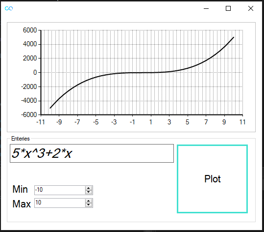
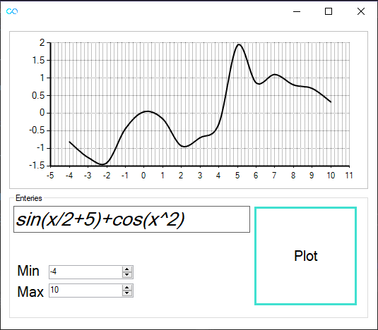
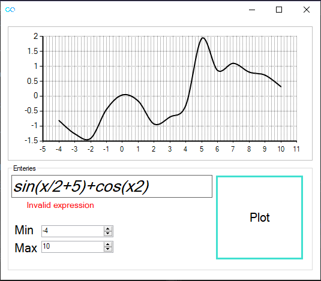
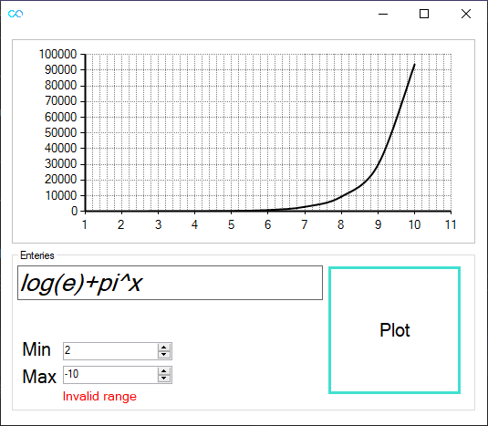

# Function Plotter
Function Plotter is a .NET windows form application plots arbitrary-user input function using **Shunting-yard algorithm** in order to parse the entry function for more information [Shunting-yard algorithm](https://en.wikipedia.org/wiki/Shunting-yard_algorithm)
* Supported functions

|function|map|
|--------|---|
|sin(x)  |sin(x)|
|cos(x)  |cos(x)|
|tan(x)  |tan(x)|
|log10(x)|log(x)|

* Supported symbols

|symbol|map|
|------|---|
|e     | e |
|&pi;    | pi|

## Valid input

## Invalid input

